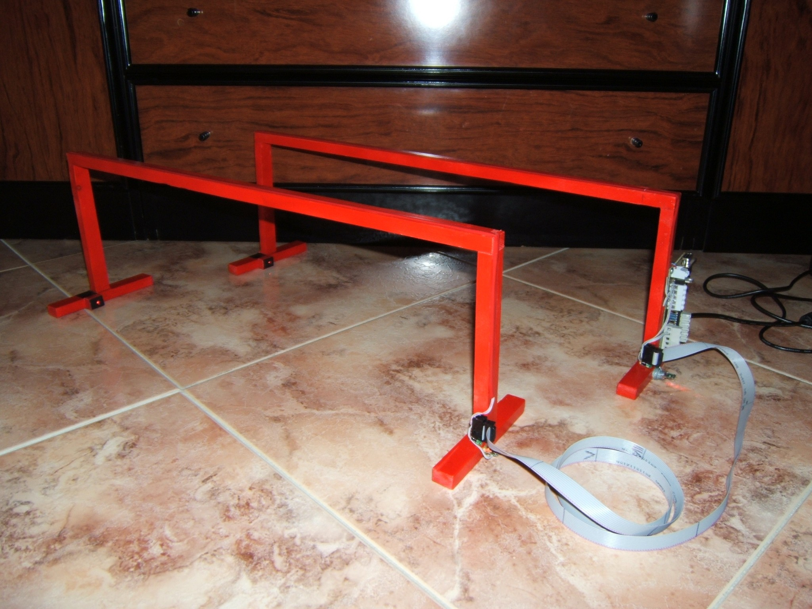
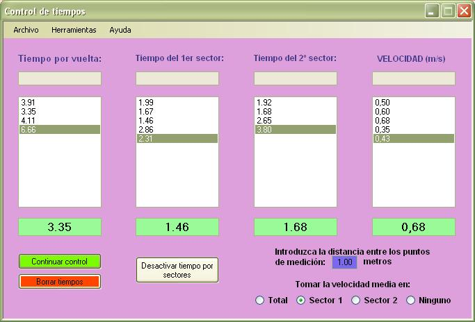

# Control de tiempos
Puentes de control de tiempos  diseñados para la medición de tiempos y velocidades en las pruebas de siguelíneas.
Están controlados por un dsPIC30F4012, programados con MPLAB y comunican con el ordenador a través de puerto serie por una interfaz programada con Visual C#.

## License

Todos estos productos están liberados mediante [Creative Commons Attribution-ShareAlike 4.0 International License](http://creativecommons.org/licenses/by-sa/4.0/).  
_All these products are released under [Creative Commons Attribution-ShareAlike 4.0 International License](http://creativecommons.org/licenses/by-sa/4.0/)._
